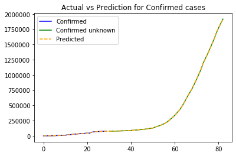
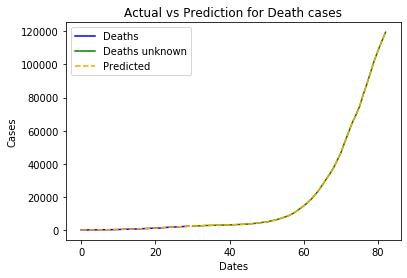
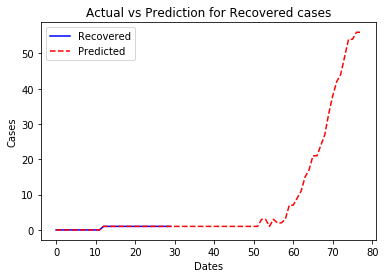

```python
import pandas as pd
from matplotlib import pyplot as plt
from keras.models import Sequential
from keras.layers import Dense

df = pd.read_csv('E:\\PYTHON TEST PROJECT\\covid\\covid_19_data.csv', parse_dates=['Last Update'])
df.rename(columns={'ObservationDate':'Date','Country/Region':'Country'}, inplace=True)
df = df[df.Country == 'Sri Lanka']
df.head()


```

    Using TensorFlow backend.
    


<div>
<style scoped>
    .dataframe tbody tr th:only-of-type {
        vertical-align: middle;
    }

    .dataframe tbody tr th {
        vertical-align: top;
    }

    .dataframe thead th {
        text-align: right;
    }
</style>
<table border="1" class="dataframe">
  <thead>
    <tr style="text-align: right;">
      <th></th>
      <th>SNo</th>
      <th>Date</th>
      <th>Province/State</th>
      <th>Country</th>
      <th>Last Update</th>
      <th>Confirmed</th>
      <th>Deaths</th>
      <th>Recovered</th>
    </tr>
  </thead>
  <tbody>
    <tr>
      <th>263</th>
      <td>264</td>
      <td>01/27/2020</td>
      <td>NaN</td>
      <td>Sri Lanka</td>
      <td>2020-01-27 23:59:00</td>
      <td>1.0</td>
      <td>0.0</td>
      <td>0.0</td>
    </tr>
    <tr>
      <th>315</th>
      <td>316</td>
      <td>01/28/2020</td>
      <td>NaN</td>
      <td>Sri Lanka</td>
      <td>2020-01-28 23:00:00</td>
      <td>1.0</td>
      <td>0.0</td>
      <td>0.0</td>
    </tr>
    <tr>
      <th>367</th>
      <td>368</td>
      <td>01/29/2020</td>
      <td>NaN</td>
      <td>Sri Lanka</td>
      <td>2020-01-29 19:30:00</td>
      <td>1.0</td>
      <td>0.0</td>
      <td>0.0</td>
    </tr>
    <tr>
      <th>422</th>
      <td>423</td>
      <td>01/30/2020</td>
      <td>NaN</td>
      <td>Sri Lanka</td>
      <td>2020-01-30 16:00:00</td>
      <td>1.0</td>
      <td>0.0</td>
      <td>0.0</td>
    </tr>
    <tr>
      <th>488</th>
      <td>489</td>
      <td>01/31/2020</td>
      <td>NaN</td>
      <td>Sri Lanka</td>
      <td>2020-01-31 23:59:00</td>
      <td>1.0</td>
      <td>0.0</td>
      <td>0.0</td>
    </tr>
  </tbody>
</table>
</div>


```python

df_date = df.groupby(["Date"])[['Confirmed', 'Deaths', 'Recovered']].sum().reset_index()


date_confirmed = df_date[['Date', 'Confirmed']]
date_death = df_date[['Date', 'Deaths']]
date_recovered = df_date[['Date', 'Recovered']]

for index, row in date_confirmed.iterrows():
        if row['Confirmed'] is None:
            row['Confirmed'] = 0.0
            
for index, row in date_death.iterrows():
    if row['Deaths'] is None:
        row['Deaths'] = 0.0

for index, row in date_recovered.iterrows():
    if row['Recovered'] is None:
        row['Recovered'] = 0.0        
```


```python
model = Sequential()
model.add(Dense(32, activation='relu', input_dim=1))
model.add(Dense(32, activation='relu'))
model.add(Dense(64, activation='relu'))
model.add(Dense(64, activation='relu'))
model.add(Dense(32, activation='relu'))
model.add(Dense(1, activation='softmax'))
model.compile(optimizer='adam', loss='binary_crossentropy', metrics=['accuracy'])
```

    WARNING:tensorflow:From c:\users\janaka_w\appdata\local\programs\python\python36\lib\site-packages\tensorflow_core\python\ops\resource_variable_ops.py:1630: calling BaseResourceVariable.__init__ (from tensorflow.python.ops.resource_variable_ops) with constraint is deprecated and will be removed in a future version.
    Instructions for updating:
    If using Keras pass *_constraint arguments to layers.
    


```python
model.fit(date_confirmed["Confirmed"][:30], date_confirmed['Confirmed'][:30], epochs=20,)
prediction_confirmed = model.predict(date_confirmed["Confirmed"])
final_prediction_confirmed = []

for i in range(0,len(prediction_confirmed)):
    final_prediction_confirmed.append(prediction_confirmed[i]*date_confirmed['Confirmed'][i])
```

    WARNING:tensorflow:From c:\users\janaka_w\appdata\local\programs\python\python36\lib\site-packages\tensorflow_core\python\ops\math_grad.py:1424: where (from tensorflow.python.ops.array_ops) is deprecated and will be removed in a future version.
    Instructions for updating:
    Use tf.where in 2.0, which has the same broadcast rule as np.where
    WARNING:tensorflow:From c:\users\janaka_w\appdata\local\programs\python\python36\lib\site-packages\keras\backend\tensorflow_backend.py:422: The name tf.global_variables is deprecated. Please use tf.compat.v1.global_variables instead.
    
    Epoch 1/20
    30/30 [==============================] - 0s 6ms/step - loss: 0.0000e+00 - accuracy: 1.0000
    Epoch 2/20
    30/30 [==============================] - 0s 99us/step - loss: 0.0000e+00 - accuracy: 1.0000
    Epoch 3/20
    30/30 [==============================] - 0s 100us/step - loss: 0.0000e+00 - accuracy: 1.0000
    Epoch 4/20
    30/30 [==============================] - 0s 67us/step - loss: 0.0000e+00 - accuracy: 1.0000
    Epoch 5/20
    30/30 [==============================] - 0s 67us/step - loss: 0.0000e+00 - accuracy: 1.0000
    Epoch 6/20
    30/30 [==============================] - 0s 67us/step - loss: 0.0000e+00 - accuracy: 1.0000
    Epoch 7/20
    30/30 [==============================] - 0s 67us/step - loss: 0.0000e+00 - accuracy: 1.0000
    Epoch 8/20
    30/30 [==============================] - 0s 100us/step - loss: 0.0000e+00 - accuracy: 1.0000
    Epoch 9/20
    30/30 [==============================] - 0s 100us/step - loss: 0.0000e+00 - accuracy: 1.0000
    Epoch 10/20
    30/30 [==============================] - 0s 67us/step - loss: 0.0000e+00 - accuracy: 1.0000
    Epoch 11/20
    30/30 [==============================] - 0s 67us/step - loss: 0.0000e+00 - accuracy: 1.0000
    Epoch 12/20
    30/30 [==============================] - 0s 67us/step - loss: 0.0000e+00 - accuracy: 1.0000
    Epoch 13/20
    30/30 [==============================] - 0s 67us/step - loss: 0.0000e+00 - accuracy: 1.0000
    Epoch 14/20
    30/30 [==============================] - 0s 67us/step - loss: 0.0000e+00 - accuracy: 1.0000
    Epoch 15/20
    30/30 [==============================] - 0s 100us/step - loss: 0.0000e+00 - accuracy: 1.0000
    Epoch 16/20
    30/30 [==============================] - 0s 102us/step - loss: 0.0000e+00 - accuracy: 1.0000
    Epoch 17/20
    30/30 [==============================] - 0s 67us/step - loss: 0.0000e+00 - accuracy: 1.0000
    Epoch 18/20
    30/30 [==============================] - 0s 67us/step - loss: 0.0000e+00 - accuracy: 1.0000
    Epoch 19/20
    30/30 [==============================] - 0s 67us/step - loss: 0.0000e+00 - accuracy: 1.0000
    Epoch 20/20
    30/30 [==============================] - 0s 66us/step - loss: 0.0000e+00 - accuracy: 1.0000
    


```python
plt.title('Actual vs Prediction for Confirmed cases')
plt.plot(date_confirmed['Confirmed'][:30], label='Confirmed', color='blue')
#plt.plot(date_confirmed['Confirmed'][30:], label='Confirmed unknown', color='green')
plt.plot(final_prediction_confirmed, label='Predicted', linestyle='dashed', color='red')
plt.legend()
plt.show()
```





```python
model.fit(date_death['Deaths'][:30],date_death['Deaths'][:30],epochs=20,)
prediction_death = model.predict(date_death['Deaths'])
final_prediction_death = []
for i in range(0,len(prediction_death)):
    final_prediction_death.append(prediction_death[i]*date_death['Deaths'][i])

#print(final_prediction_death)
plt.title('Actual vs Prediction for Death cases')
plt.xlabel('Dates')
plt.ylabel('Cases')
plt.plot(date_death['Deaths'][:30], label='Deaths', color='blue')
#plt.plot(date_death['Deaths'][30:], label='Deaths unknown', color='green')
plt.plot(final_prediction_death, label='Predicted', linestyle='dashed', color='red')
plt.legend()
plt.show()
```

    Epoch 1/20
    30/30 [==============================] - 0s 66us/step - loss: 15.3332 - accuracy: 0.0000e+00
    Epoch 2/20
    30/30 [==============================] - 0s 67us/step - loss: 15.3332 - accuracy: 0.0000e+00
    Epoch 3/20
    30/30 [==============================] - 0s 67us/step - loss: 15.3332 - accuracy: 0.0000e+00
    Epoch 4/20
    30/30 [==============================] - 0s 33us/step - loss: 15.3332 - accuracy: 0.0000e+00
    Epoch 5/20
    30/30 [==============================] - 0s 67us/step - loss: 15.3332 - accuracy: 0.0000e+00
    Epoch 6/20
    30/30 [==============================] - 0s 67us/step - loss: 15.3332 - accuracy: 0.0000e+00
    Epoch 7/20
    30/30 [==============================] - 0s 67us/step - loss: 15.3332 - accuracy: 0.0000e+00
    Epoch 8/20
    30/30 [==============================] - 0s 67us/step - loss: 15.3332 - accuracy: 0.0000e+00
    Epoch 9/20
    30/30 [==============================] - 0s 33us/step - loss: 15.3332 - accuracy: 0.0000e+00
    Epoch 10/20
    30/30 [==============================] - 0s 67us/step - loss: 15.3332 - accuracy: 0.0000e+00
    Epoch 11/20
    30/30 [==============================] - 0s 100us/step - loss: 15.3332 - accuracy: 0.0000e+00
    Epoch 12/20
    30/30 [==============================] - 0s 67us/step - loss: 15.3332 - accuracy: 0.0000e+00
    Epoch 13/20
    30/30 [==============================] - 0s 67us/step - loss: 15.3332 - accuracy: 0.0000e+00
    Epoch 14/20
    30/30 [==============================] - 0s 66us/step - loss: 15.3332 - accuracy: 0.0000e+00
    Epoch 15/20
    30/30 [==============================] - 0s 67us/step - loss: 15.3332 - accuracy: 0.0000e+00
    Epoch 16/20
    30/30 [==============================] - 0s 67us/step - loss: 15.3332 - accuracy: 0.0000e+00
    Epoch 17/20
    30/30 [==============================] - 0s 100us/step - loss: 15.3332 - accuracy: 0.0000e+00
    Epoch 18/20
    30/30 [==============================] - 0s 67us/step - loss: 15.3332 - accuracy: 0.0000e+00
    Epoch 19/20
    30/30 [==============================] - 0s 67us/step - loss: 15.3332 - accuracy: 0.0000e+00
    Epoch 20/20
    30/30 [==============================] - 0s 67us/step - loss: 15.3332 - accuracy: 0.0000e+00
    





```python
model.fit(date_recovered['Recovered'][:30],date_recovered['Recovered'][:30],epochs=20,)
prediction_recovered = model.predict(date_recovered['Recovered'])
final_prediction_recovered = []

for i in range(0,len(prediction_recovered)):
    final_prediction_recovered.append(prediction_recovered[i]*date_recovered['Recovered'][i])

#print(final_prediction_recovered)
plt.title('Actual vs Prediction for Recovered cases')
plt.xlabel('Dates')
plt.ylabel('Cases')
plt.plot(date_recovered['Recovered'][:30], label='Recovered', color='blue')
#plt.plot(date_recovered['Recovered'][30:], label='Recovered unknown', color='green')
plt.plot(final_prediction_recovered, label='Predicted', linestyle='dashed', color='red')
plt.legend()
plt.show()
```

    Epoch 1/20
    30/30 [==============================] - 0s 67us/step - loss: 6.1333 - accuracy: 0.6000
    Epoch 2/20
    30/30 [==============================] - 0s 67us/step - loss: 6.1333 - accuracy: 0.6000
    Epoch 3/20
    30/30 [==============================] - 0s 67us/step - loss: 6.1333 - accuracy: 0.6000
    Epoch 4/20
    30/30 [==============================] - 0s 33us/step - loss: 6.1333 - accuracy: 0.6000
    Epoch 5/20
    30/30 [==============================] - 0s 67us/step - loss: 6.1333 - accuracy: 0.6000
    Epoch 6/20
    30/30 [==============================] - 0s 67us/step - loss: 6.1333 - accuracy: 0.6000
    Epoch 7/20
    30/30 [==============================] - 0s 67us/step - loss: 6.1333 - accuracy: 0.6000
    Epoch 8/20
    30/30 [==============================] - 0s 67us/step - loss: 6.1333 - accuracy: 0.6000
    Epoch 9/20
    30/30 [==============================] - 0s 68us/step - loss: 6.1333 - accuracy: 0.6000
    Epoch 10/20
    30/30 [==============================] - 0s 67us/step - loss: 6.1333 - accuracy: 0.6000
    Epoch 11/20
    30/30 [==============================] - 0s 67us/step - loss: 6.1333 - accuracy: 0.6000
    Epoch 12/20
    30/30 [==============================] - 0s 67us/step - loss: 6.1333 - accuracy: 0.6000
    Epoch 13/20
    30/30 [==============================] - 0s 67us/step - loss: 6.1333 - accuracy: 0.6000
    Epoch 14/20
    30/30 [==============================] - 0s 33us/step - loss: 6.1333 - accuracy: 0.6000
    Epoch 15/20
    30/30 [==============================] - 0s 67us/step - loss: 6.1333 - accuracy: 0.6000
    Epoch 16/20
    30/30 [==============================] - 0s 33us/step - loss: 6.1333 - accuracy: 0.6000
    Epoch 17/20
    30/30 [==============================] - 0s 33us/step - loss: 6.1333 - accuracy: 0.6000
    Epoch 18/20
    30/30 [==============================] - 0s 67us/step - loss: 6.1333 - accuracy: 0.6000
    Epoch 19/20
    30/30 [==============================] - 0s 67us/step - loss: 6.1333 - accuracy: 0.6000
    Epoch 20/20
    30/30 [==============================] - 0s 67us/step - loss: 6.1333 - accuracy: 0.6000
    





```python

```


```python

```


```python

```
